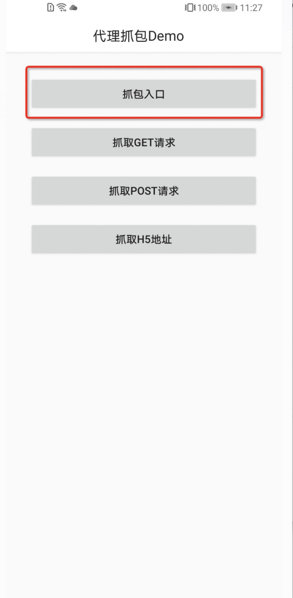
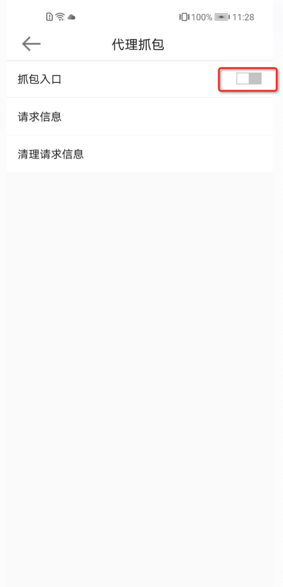
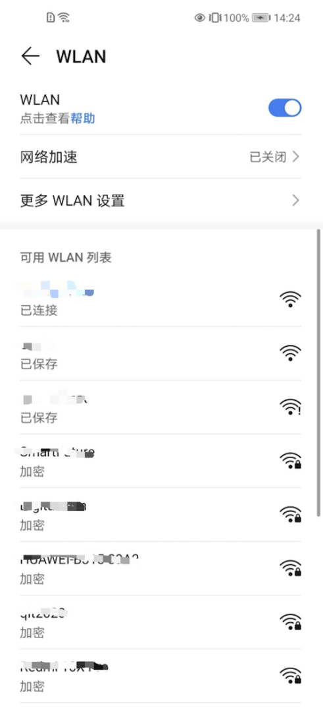
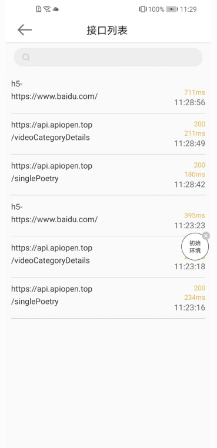
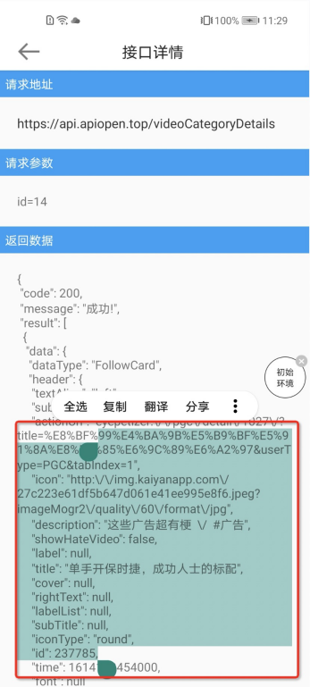
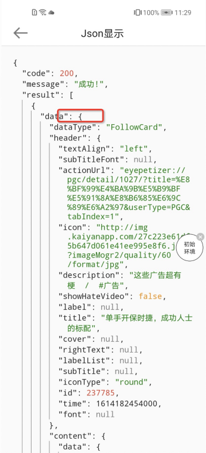
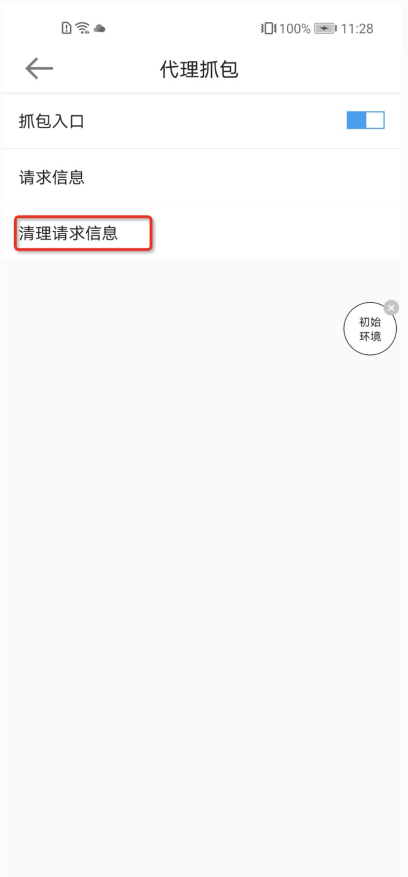
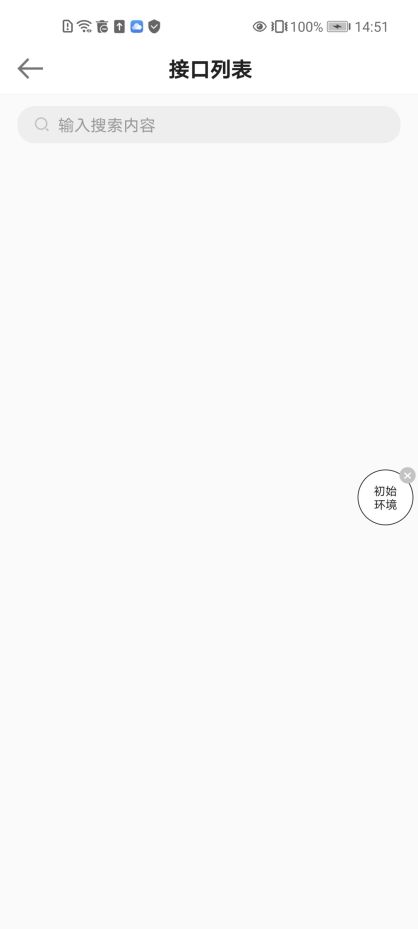

# Android 应用内抓包

### 1、背景

平时开发及使用经常会遇到需要抓接口的情形，以往的抓包场景有两种：

- 第一种是手机端连接电脑，电脑打开抓包工具，进行内部接口抓取，但此种方式需要设备、工具齐全，https请求还需要安装信任
  证书，若身边没有电脑就无法操作；
- 第二种是手机端安装抓包工具进行接口抓取，但抓包工具往往收费的比较多，使用免费或破解版又会担心数据安全问题。

为了使任何安装了APP设备在出现任何接口异常或者接口数据需要考证的时候，能及时抓取接口验证，因此就孕育而生应用内抓包的功能
模块的研究及开发。

### 2、设计思路

* 需要有一个可控制是否抓包的开关
* 接口请求列表，最好在列表上可以简单了解到一些信息，例如接口地址、请求状态（成功与否）、请求用时等
* 接口请求详情，接口请求具体信息，包含请求地址、状态、参数、结果、错误信息
* 搜索功能，可搜索特定的一批或一个接口
* 排序功能，按请求时间正序或者倒序
* 考虑到内存问题，默认缓存特定数量的接口请求，并且可以手动清除所有请求
* 有个悬浮在窗口层的悬浮按钮，方便进入工具的展示及操作列表

### 3、设计实现

* 抓包开关

  开启抓包时，抓包库内部对Android10以上系统动态申请android.permission.ACCESS_FINE_LOCATION

  权限配置，Android10及以上系统显示Wi-Fi名称，要动态申请android.permission.ACCESS_FINE_LOCATION

  ```java
  <!-- 获取悬浮的权限 -->
  <uses-permission android:name="android.permission.SYSTEM_ALERT_WINDOW" />
  <!--网络状态-->
  <uses-permission android:name="android.permission.ACCESS_NETWORK_STATE" />
  <!--wifi状态权限-->
  <uses-permission android:name="android.permission.ACCESS_WIFI_STATE" />
  <!--如果是安卓10.0，需要后台获取连接的wifi名称则添加进程获取位置信息权限 -->
  <uses-permission android:name="android.permission.ACCESS_BACKGROUND_LOCATION" />
  <!--android 10.0使用wifi api新添加的权限 此权限需动态申请-->
  <uses-permission android:name="android.permission.ACCESS_FINE_LOCATION" />
  ```

  注册网络改变广播

  ```java
  /**
   * 注册网络改变的广播
   */
  private void registerNetworkConnect() {
      IntentFilter filter = new IntentFilter();
      //监听wifi连接（手机与路由器之间的连接）
      filter.addAction(WifiManager.NETWORK_STATE_CHANGED_ACTION);
      //监听互联网连通性（也就是是否已经可以上网了），当然只是指wifi网络的范畴
      filter.addAction(WifiManager.WIFI_STATE_CHANGED_ACTION);
      //这个是监听网络状态的，包括了wifi和移动网络。
      filter.addAction(ConnectivityManager.CONNECTIVITY_ACTION);
      networkConnectChangedReceiver = new NetworkConnectChangedReceiver();
      context.registerReceiver(networkConnectChangedReceiver, filter);
  }
  
  /**
   * Wi-Fi改变的监听
   */
  public class NetworkConnectChangedReceiver extends BroadcastReceiver {
      @Override
      public void onReceive(Context context, Intent intent) {
          // 这个监听网络连接的设置，包括wifi和移动数据的打开和关闭。.
          if (ConnectivityManager.CONNECTIVITY_ACTION.equals(intent.getAction())) {
              NetworkInfo info = intent.getParcelableExtra(ConnectivityManager.EXTRA_NETWORK_INFO);
              if (info != null && info.isConnected()) {
                  // 设置当前网络环境
              } else {
                  // 设置没有网络
              }
          }
      }
  }
  ```

* 获取接口数据

  举例okhttp3设置拦截器获取接口数据

  ```java
  // 网络框架
  implementation 'com.squareup.okhttp3:okhttp:4.3.0'
  implementation 'com.lzy.net:okhttputils:1.8.1'
  ```

  添加拦截器

  ```java
  OkHttpUtils.init(application);
  HttpLoggingInterceptor interceptor = new HttpLoggingInterceptor("OkHttp");
  interceptor.setPrintLevel(HttpLoggingInterceptor.Level.BODY);//log打印级别，决定了log显示的详细程度
  interceptor.setColorLevel(Level.INFO);
  OkHttpUtils.getInstance().addInterceptor(interceptor);
  ```

  拦截器中获取接口数据

  接口地址url：

  ```java
  url = request.url().toString();
  ```

  请求参数requestString：

  ```java
  Request copy = request.newBuilder().build();
  RequestBody body = copy.body();
  if (body == null) return;
  Buffer buffer = new Buffer();
  body.writeTo(buffer);
  Charset charset = getCharset(body.contentType());
  requestString = buffer.readString(charset);
  ```

  请求状态code：

  ```java
  Response.Builder builder = response.newBuilder();
  Response clone = builder.build();
  code = clone.code();
  ```

  请求时间dateStr：

  ```java
  String dateStr = DateUtil.getString(new Date(), DateUtil.PATTERN_HMS);
  ```

  响应耗时tookMs：响应成功时间-发送请求时间

  ```java
  long tookMs = TimeUnit.NANOSECONDS.toMillis(System.nanoTime() - startNs);
  ```

  响应数据body：

  ```java
  byte[] bytes = IOUtils.toByteArray(responseBody.byteStream());
  MediaType contentType = responseBody.contentType();
  body = new String(bytes, getCharset(contentType));
  ```

* 存储接口数据

  将拦截器或网络基类中获取的接口数据添加到List中

  ```java
  HttpCaptureData.getSingleton().create()// 创建CaptureData收集对象
          .setCaptureHost(host)// host域名
          .setCaptureStatus(status)// 接口状态
          .setCaptureDate(dateStr)// 请求时间
          .setCaptureTime(ms)// 请求时长
          .setCaptureUrl(debugUrl)// 请求地址
          .setCaptureRequestStr(requestStr)// 请求参数
          .setCaptureResponseStr(responseStr)// 响应结果
          .add();// 添加集合
  ```

  设置List线程安全

  ```go
  httpCaptureList = Collections.synchronizedList(new ArrayList<>());
  ```

  设置最多存储200条数据

  ```go
  List<CaptureInterfaceItemBean> captureList = HttpCaptureData.getSingleton().httpCaptureList;
  captureList.add(0, captureInterfaceItemBean);
  // 最多200条
  if (captureList.size() > 200) {
      captureList.remove(200);
  }
  ```

* 显示接口数据

  将接口数据以Json格式显示

  ```go
  // 判断是否为json数据
  if (JsonUtil.isJson(json)) {
      // 如果是json，就以json格式显示
      jsonObject = new JSONObject(json);
      tvJson.setText(jsonObject.toString(1));
  } else {
      tvJson.setText(json);
  }
  ```

  使用JsonView自定义控件，展示出Json 的结构，并可展开和缩起

  ```go
  try {
          // 显示json数据
          JSONObject jsonObject = new JSONObject(jsonStr);
          jsonViewer.setJson(jsonObject);
      } catch (JSONException e) {
          e.printStackTrace();
      }
  ```

* 分享接口数据

  将TextView设置android:textIsSelectable="true"后即可实现长按复制、分享功能

  ```go
  <TextView
      android:layout_width="wrap_content"
      android:layout_height="wrap_content"
      android:text=""
      android:textIsSelectable="true" />
  ```

* 清理接口数据

  ```java
  HttpCaptureData.getSingleton().httpCaptureList.clear();
  ```

###    4、Demo介绍

* 开启调试入口

  开启后显示悬浮球，小球上会显示当前网络环境，Wi-Fi名称或移动网络。

  

  长按悬浮球进行网络切换（长按）                                             单击小球快捷进入代理抓包页面（单击）

                                      

* 请求信息

  请求信息长按可复制，单击可显示Json结构，Json结构点击“{”可缩起

  

* 清理请求信息

                                          

### 5、集成步骤

* 导入依赖库

  ```go
  implementation project(':httpcapturelibrary')
  ```

* 初始化

  ```go
  HttpCaptureManager.getInstance().init(this);
  ```

* 在网络拦截器或网络请求基类中添加收集接口信息代码

  提示：网络拦截器收集信息时候需要注意response.body只能读取一次，多次使用报java.lang.IllegalStateException: closed，可以通过response.newBuilder()重新构建返回，来获取body。

  ```java
  boolean isOpenCapture = HttpCaptureSPUtil.getIsOpenCapture();
  // 如果抓包开关打开后再进行数据获取
  if (isOpenCapture) {
  	HttpCaptureData.getSingleton().create()// 创建CaptureData收集对象
          .setCaptureHost(host)// host域名
          .setCaptureStatus(status)// 接口状态
          .setCaptureDate(dateStr)// 请求时间
          .setCaptureTime(ms)// 请求时长
          .setCaptureUrl(debugUrl)// 请求地址
          .setCaptureRequestStr(requestStr)// 请求参数
          .setCaptureResponseStr(responseStr)// 响应结果
          .add();// 添加集合
  }
  ```

* 跳转抓包首页，开启抓包模式

  ```java
  HttpCaptureHomeActivity.start(context);
  ```

  